

# a11g-final-submission

**Team Number: 22**

**Team Name: Arachne**

| Team Member Name | Email Address          | GitHub Username |
| ---------------- | ---------------------- | --------------- |
| Amehja Williams  | amehjaw@seas.upenn.edu | prm2023         |
| Lubha Churiwala  | lubha@seas.upenn.edu   | LubhaC          |

**GitHub Repository URL: https://github.com/ese5160/a11g-final-submission-s26-s26-t22-arachne.git**

## 1. Video Presentation

## 2. Project Summary

## 3. Hardware & Software Requirements

## HRS

| ID     | Description                                                                                                                                                    | Result             |
| ------ | -------------------------------------------------------------------------------------------------------------------------------------------------------------- | ------------------ |
| HRS-01 | The piggy bank shall host 4 sensor slots for each denomination of coin (quarter, nickel, penny, dime).                                                         | Achieved           |
| HRS-02 | The piggy bank shall have 2 servo motors, one driving each ear, each capable of at least 30° of rotation                                                      | Not Achieved       |
| HRS-03 | The piggy bank shall have 1 servo motor driving the tail, capable of at least 45° of rotation.                                                                | Not Achieved       |
| HRS-04 | The piggy bank shall host a speaker with a minimum output of 60 dB at 0.5m.                                                                                    | Achieved           |
| HRS-05 | The piggy bank shall host a bright and legible LCD Screen, displying the balance inside.                                                                       | Not Achieved       |
| HRS-06 | The SIWG917Y121MGABA should operate within its specified voltage range (3.0V to 3.63 V).                                                                       | Achieved           |
| HRS-07 | The piggy bank shall use the SIWG917Y121MGABA Wi-Fi-enabled MCU for firmware.                                                                                  | Achieved           |
| HRS-08 | Upon coin insertion detection, all output peripherals (ear servos, tail servo, speaker, LCD) shall respond within 3s of the sensor trigger.                    | Partially achieved |
| HRS-09 | Each optical sensor shall detect coin insertion with a minimum accuracy of 95% across 20 consecutive test drops per denomination under normal indoor lighting. | Achieved           |
| HRS-10 | The physical encasing should be able to protect the PCB from external environmental factors like dust and water no exposed openings except the 4 coin slots.   | Achieved           |

## SRS

| ID     | Description                                                                                                                                              | Result       |
| ------ | -------------------------------------------------------------------------------------------------------------------------------------------------------- | ------------ |
| SRS-01 | The system shall initialize counters for each denomination to track their quantity within 3s of power-on..                                               | Achieved     |
| SRS-02 | When an optical cross-beam sensor detects a deposit, the system shall increment the counter for that denomination by 1.                                  | Achieved     |
| SRS-03 | The system shall log deposits in JSON format.                                                                                                            | Achieved     |
| SRS-04 | When a deposit is logged, the log shall include the date, denomination, and quantity of the coin.                                                        | Achieved     |
| SRS-05 | When a deposit is logged, the system shall transmit it wirelessly to the cloud application within 3s of the deposit event under normal Wi-Fi conditions. | Achieved     |
| SRS-06 | The LCD shall display the updated total balance within 3s of a deposit event.                                                                            | Achieved     |
| SRS-07 | The Node-RED dashboard shall update the data within 3 seconds of a deposit event being transmitted.                                                      | Achieved     |
| SRS-08 | The system shall complete full boot and be ready to detect coin insertions within 5 seconds of power-on.                                                 | Achieved     |
| SRS-09 | Each ear servo and the tail servo shall return to their resting position within 10 seconds of starting rotation.                                         | Not Achieved |
| SRS-10 | The speaker shall play the oink noise at a consistent volume level on every deposit trigger.                                                             | Achieved     |

## 4. Project Photos & Screenshots

1. Casework

   

   </img> </img> </img> </img> 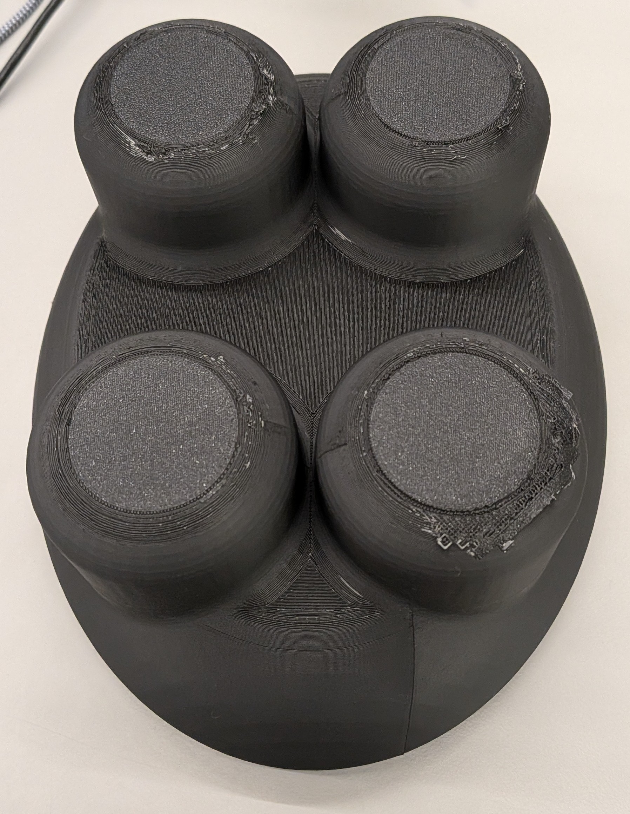</img>

   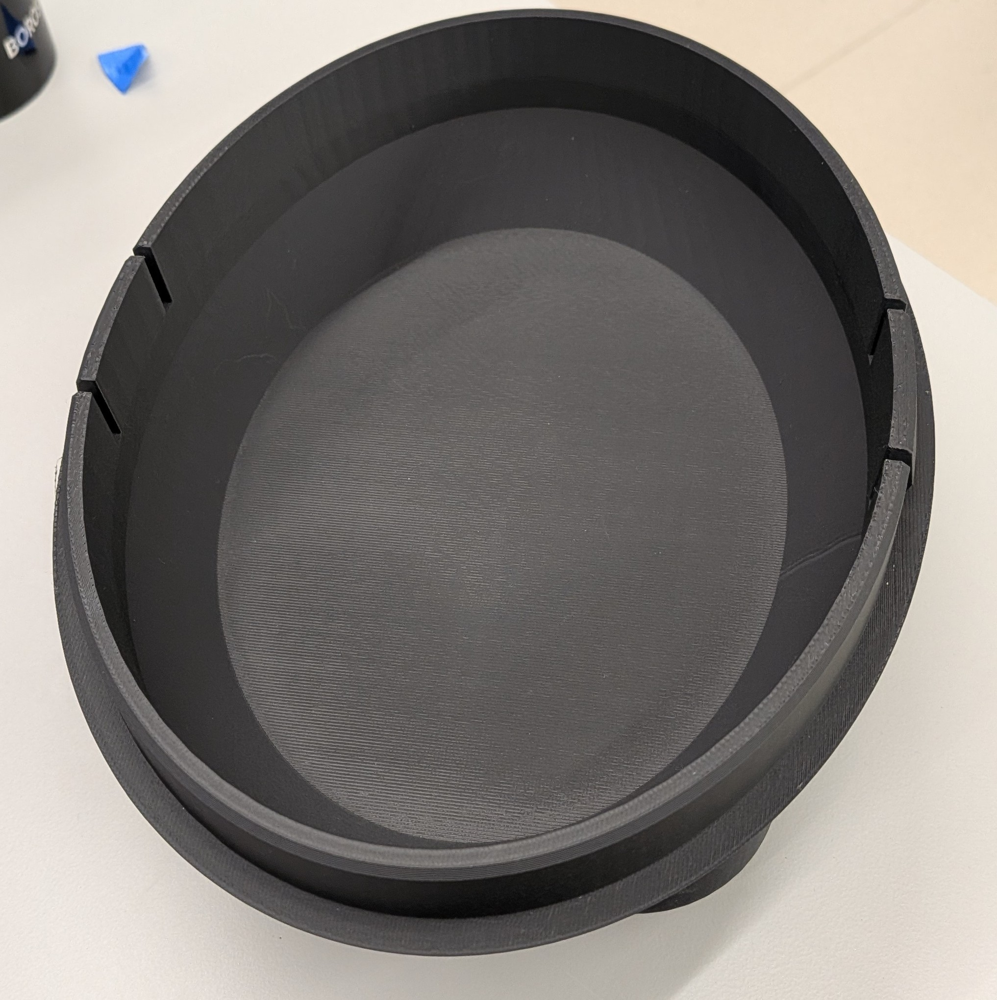
2. The standalone PCBA, top

   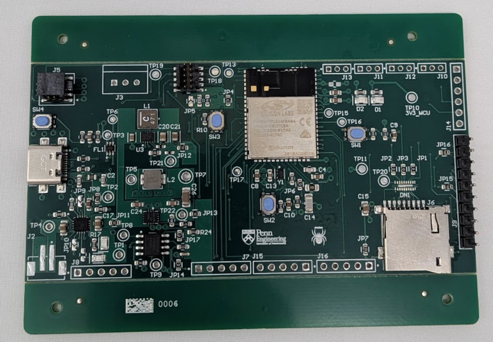
3. The standalone PCBA, bottom

   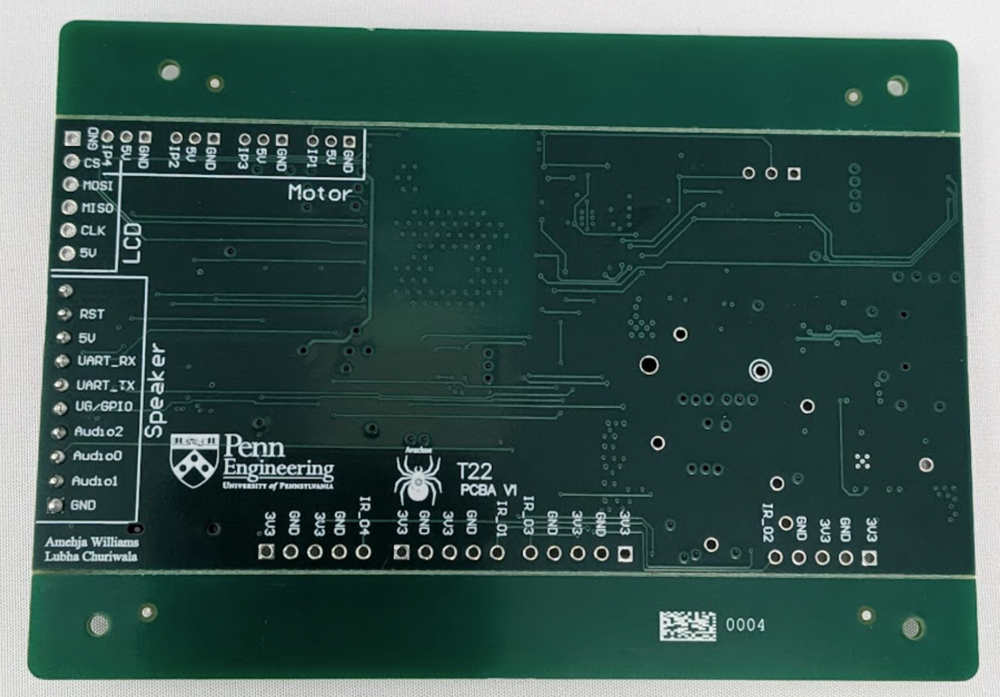
4. Thermal camera image while the board is running under load

   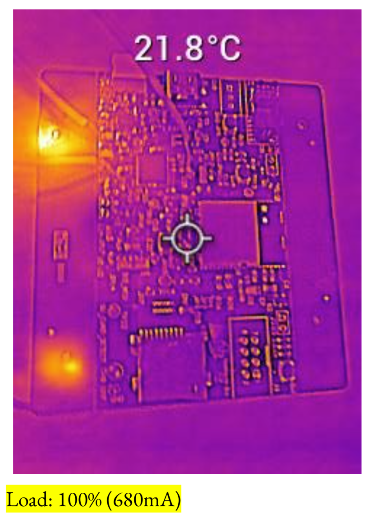
5. The Altium Board design in 2D view (screenshot)

   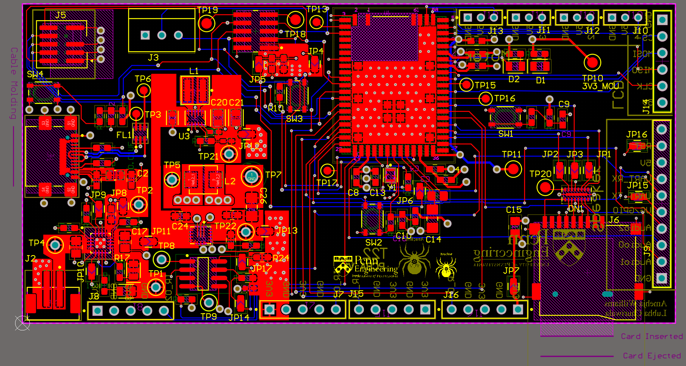
6. The Altium Board design in 3D view (screenshot)

   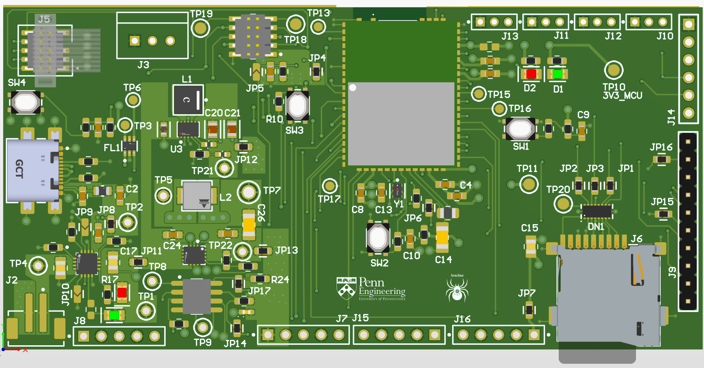

   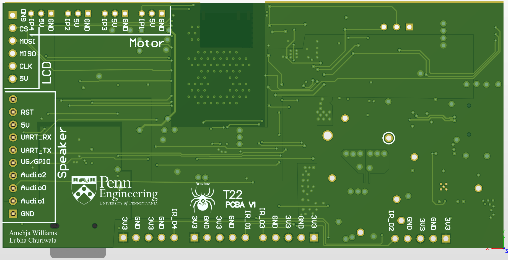
7. Node-RED dashboard (screenshot)

   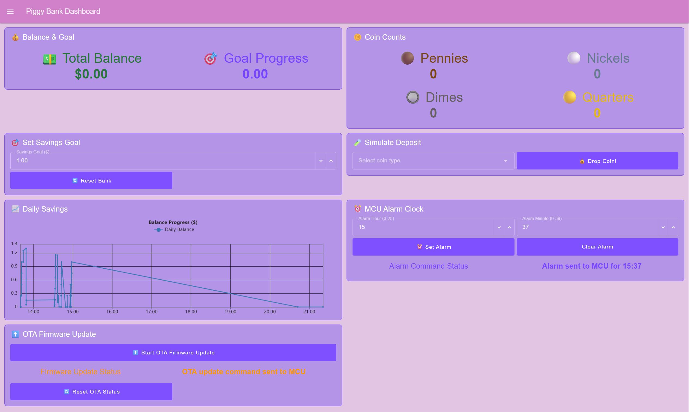
8. Node-RED backend (screenshot)

   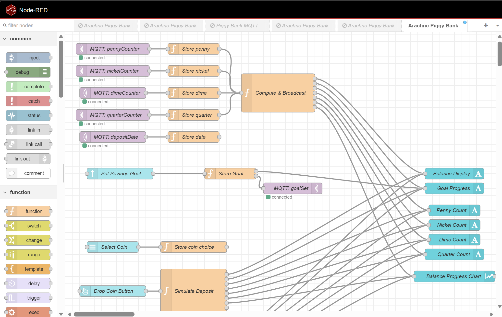

   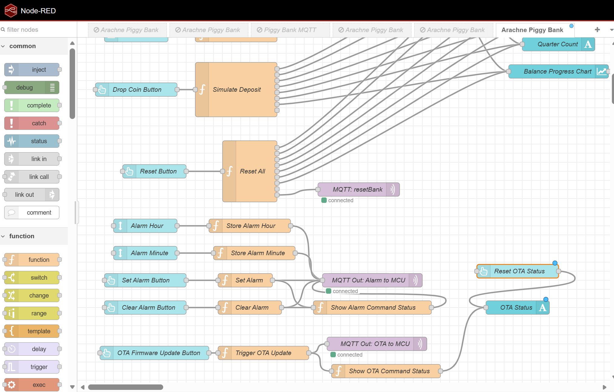
9. Block diagram of your system

   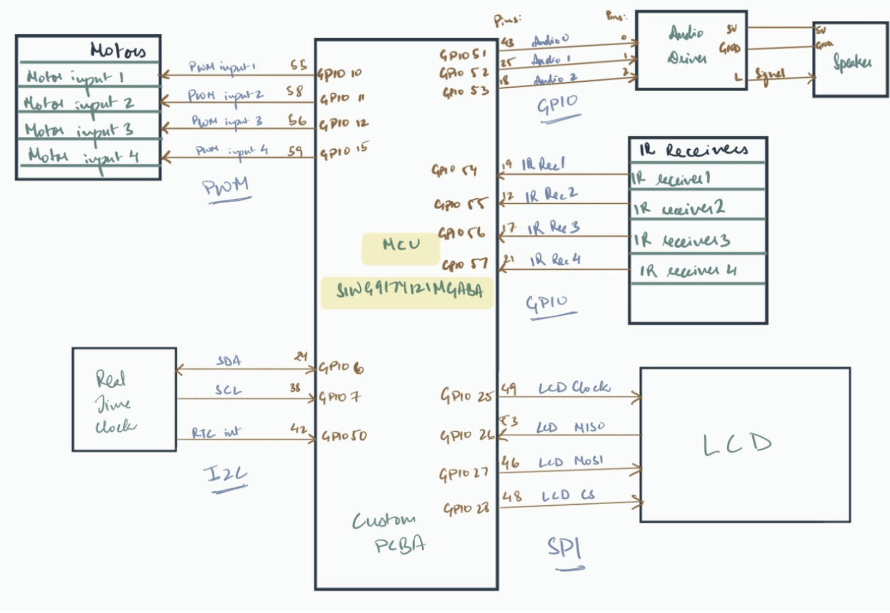

## 5. Codebase

Do *not* commit any of your source code to this repository. Rather, provide links to the other GitHub repository you've already been using with your firmware.

- A link to your final embedded C firmware codebases
- A link to your Node-RED dashboard code
- Links to any other software required for the functionality of your device
