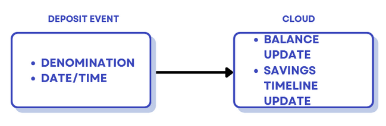
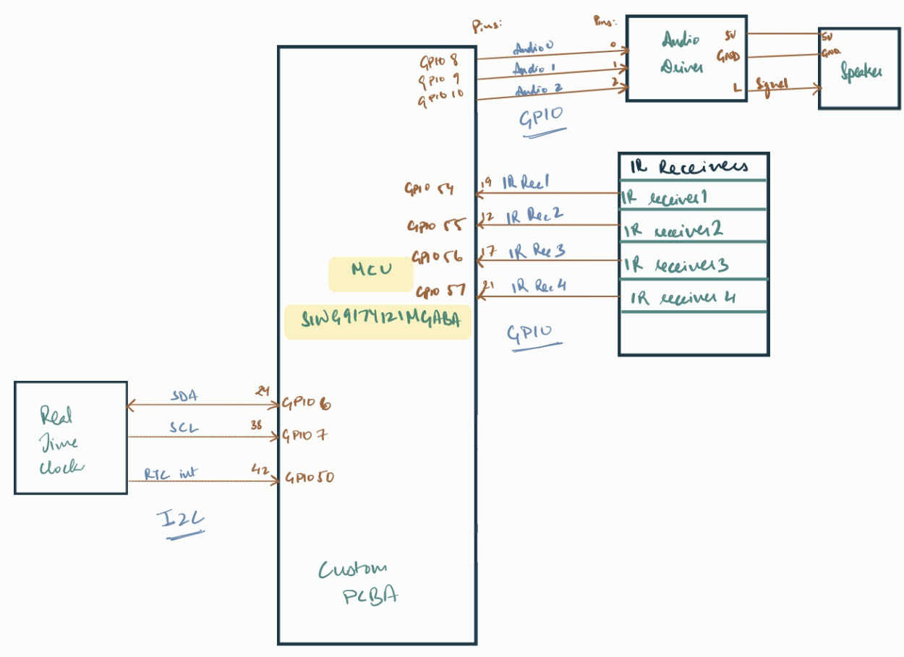
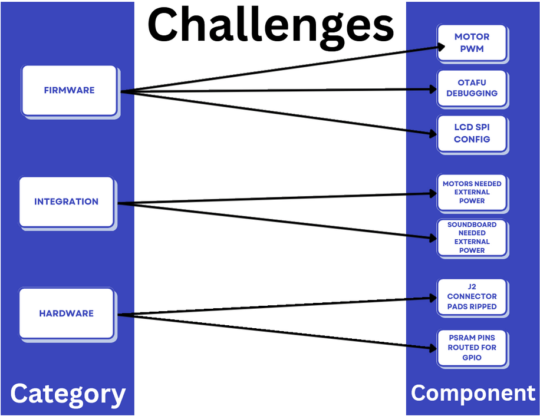
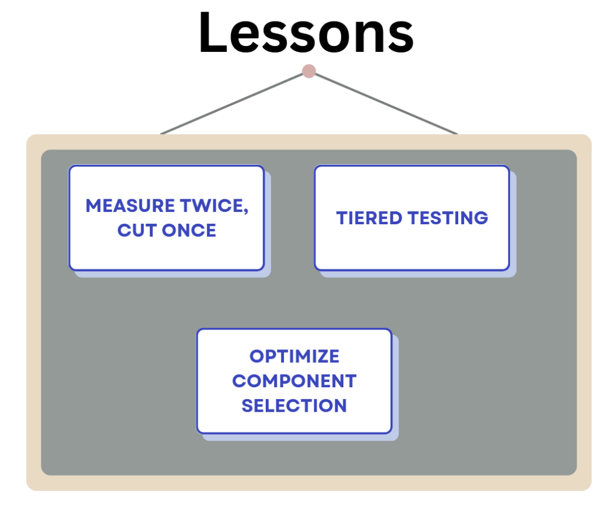
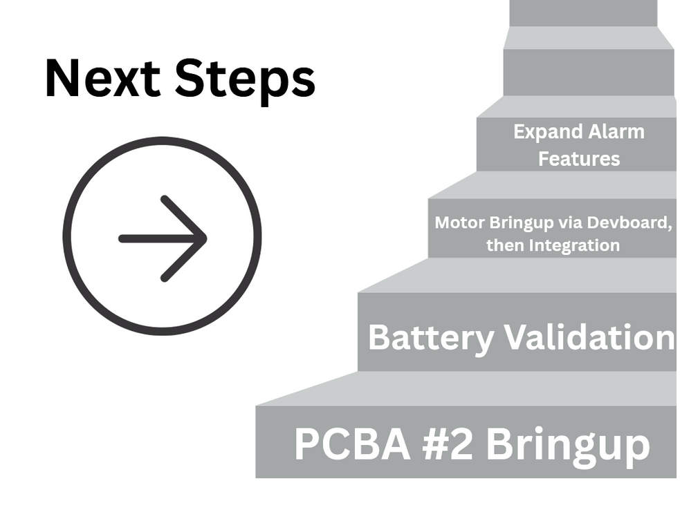

# a11g-final-submission

**Team Number: 22**

**Team Name: Arachne**

| Team Member Name | Email Address          | GitHub Username |
| ---------------- | ---------------------- | --------------- |
| Amehja Williams  | amehjaw@seas.upenn.edu | prm2023         |
| Lubha Churiwala  | lubha@seas.upenn.edu   | LubhaC          |

**GitHub Repository URL: https://github.com/ese5160/a11g-final-submission-s26-s26-t22-arachne.git**

## 1. Video Presentation: [https://drive.google.com/file/d/1NOnBmTIpOmjb-eG-j_7bhOsVzotfvLr7/view?usp=sharing](https://drive.google.com/file/d/1NOnBmTIpOmjb-eG-j_7bhOsVzotfvLr7/view?usp=sharing)

## 2. Project Summary:

* **Device Description**

  * Our Project: Arachne: The Smart Money Monitoring System
  * Inspiration: Building financial savviness at any age.
  * Problem: There are plenty of apps that help kids and adults alike manage their money, but we wanted to integrate an interactive physical system that builds good savings habits.
  * How do you use the Internet to augment your device functionality?: Towards this end, the IoT aspect of our project was critical for encouraging financial awareness, both when users are at home with the piggy bank and when they are away. The IoT-augmented mobile application allows users to track their savings habits and bank balance on-the-go.
* **Device Functionality**

  * Explain how your Internet-connected device is designed: The core of our  IoT device design is the integration of four break-beam IR sensors, one for each denomination of coin (nickel, quarter, penny, and dime). When an emitter-receiver pair is broken, that sensor triggers a deposit event.
  * 
* **System Block Diagram:**
* **Challenges**

  * Where did you face difficulties? How did you solve them? This could be in firmware, hardware, software, integration, etc.:

    

    * Our firmware challenges revolved around troubleshooting issues with the motors, over-the-air-firmware-update, and the LCD SPI configuration. The PWM commands we were sending the motors built without errors. However, when the event triggered motor rotation, they stalled.
      * Solution: We surmised that the PCB power architecture did not provide enough current to the motors for the 360 degree rotation. Thus, we attempted to power the motors externally but observed the same stalled behavior.
    * Our integration challenges primarily dealt with needing to power both the motors (see above) and soundboard externally.  The soundboard draws 3A of current whereas our PCB supplies a max of 2A.
      * Solution: We utilized the DC power supply to provide power for both the soundboard and motors during debugging.
    * The hardware integration challenges we faced involved a) the J2 (battery) connector and b) the PSRAM pins on the MCU. The J2 connector was unfortunately ripped off when we attempted to unplug the battery from the PCB during debugging. The GPIO pins we routed to the soundboard header during the PCB design stage turned out to be PSRAM pins, which are reserved for MCU usage.
      * Solution A: We soldered a new connector. Although the connector had successfully powered the board and all brung-up peripherals before being ripped off, it no longer functioned when a new connector was soldered. Thus, we surmised there was damage to the pads.
      * Solution B: Since motor bring-up was unsuccessful, we decided to utilize one of those GPIO pins (GPIO_10) as well as the extra UART (TX,RX) pins we had routed as a backup usage mode for the soundboard.
* **Prototype Learnings**

  

  * What lessons did you learn by building and testing this prototype?
    * Measure Twice, Cut Once: The routing of the PSRAM pins could have been avoided with more insight from the datasheet. Next time, we would go over our entire pin assignment diagram using the Pin Tool in simplicity studio and make sure we are not utilizing reserved pins.
    * Tiered testing: We learned how useful both devboards and breadboards can be for isolating issues with peripherals. We were very grateful to be able to use the devboard to test our soundboard and speaker to ensure proper functionality before integration. We also learned how to isolate firmware problems and developed an effective debugging checklist (i.e. first checking power and connections, continuity testing with the multimeter, then correct firmware version, cloud connectivity, etc.)?
  * What would you do differently if you had to build this device again?
    * Component Selection: We would be more cognizant of our design decisions for component selection. The soundboard requires 3A of current alone, so we would have selected a less power-hungry board. Nevertheless, it was a very successful peripheral because of prior experience with this component, though it came at the cost of more power.
* **Next Steps & Takeaways**

  

  * What steps are needed to finish or improve this project?

    * We would like to bring up our 2nd PCBA and validate the battery validation so that all debugging starts and ends with the battery being plugged in. Initially, we had done all debugging with USB power and then attempted to shift to battery power only. We could then troubleshoot the motor separately and expand the alarm features so that users can set multiple alarm sounds if they so choose.
  * What did you learn in ESE5160 through the lectures, assignments, and this course-long prototyping project?

    * RTOS task scheduling and the bootloader quiz were essential in understanding the key turning points of our project.
* **Project Links**

  * Provide a URL to your Node-RED instance for our review (make sure it’s running on your Azure instance!):
    * Dashboard: [http://52.159.83.167:1880/dashboard/](http://52.159.83.167:1880/dashboard/)
    * Instance: [http://52.159.83.167:1880/](http://52.159.83.167:1880/)
  * Provide the share link to your final PCBA on Altium 365.: [https://upenn-eselabs.365.altium.com/designs/50E9F919-A841-4818-932F-F08D4C5303F6](https://upenn-eselabs.365.altium.com/designs/50E9F919-A841-4818-932F-F08D4C5303F6)

## 3. Hardware & Software Requirements:

## HRS

| ID     | Description                                                                                                                                                    | Result             | Validation Method                                                                                                                                 |
| ------ | -------------------------------------------------------------------------------------------------------------------------------------------------------------- | ------------------ | -------------------------------------------------------------------------------------------------------------------------------------------------- |
| HRS-01 | The piggy bank shall host 4 sensor slots for each denomination of coin (quarter, nickel, penny, dime).                                                         | Achieved           | Physical inspection to see that there are 4 coin holes for each denomination.                                                                      |
| HRS-02 | The piggy bank shall have 2 servo motors, one driving each ear, each capable of at least 30° of rotation                                                      | Not Achieved       | Due to hardware constraints and time limitations, the PWM debugging process could not be completed.                                                |
| HRS-03 | The piggy bank shall have 1 servo motor driving the tail, capable of at least 45° of rotation.                                                                | Not Achieved       | Not enough time to debug the PWM signals to drive the servo motor.                                                                                 |
| HRS-04 | The piggy bank shall host a speaker with a minimum output of 60 dB at 0.5m.                                                                                    | Achieved           | Tested speaker using a phone dB meter at 0.5 m; measured output was above 60 dB during oink playback.                                              |
| HRS-05 | The piggy bank shall host a bright and legible LCD Screen, displying the balance inside.                                                                       | Not Achieved       | Tested LCD by powering system. SPI integration with PCB could not be completed due to time constraints                                             |
| HRS-06 | The SIWG917Y121MGABA should operate within its specified voltage range (3.0V to 3.63 V).                                                                       | Achieved           | Measured MCU supply voltage using a multimeter; voltage stayed within 3.0–3.63 V during operation.                                                |
| HRS-07 | The piggy bank shall use the SIWG917Y121MGABA Wi-Fi-enabled MCU for firmware.                                                                                  | Achieved           | Verified firmware was flashed and executed on the SIWG917Y121MGABA Wi-Fi MCU using serial monitor                                                  |
| HRS-08 | Upon coin insertion detection, all output peripherals (ear servos, tail servo, speaker, LCD) shall respond within 3s of the sensor trigger.                    | Partially achieved | Measured delay from sensor trigger to output response using timestamps; speaker/cloud response was under 3 s, but servo/LCD could no be integrated |
| HRS-09 | Each optical sensor shall detect coin insertion with a minimum accuracy of 95% across 20 consecutive test drops per denomination under normal indoor lighting. | Achieved           | Dropped each denomination 20 times through its sensor slot; each sensor detected at least 19/20 drops, meeting 95% accuracy.                       |
| HRS-10 | The physical encasing should be able to protect the PCB from external environmental factors like dust and water no exposed openings except the 4 coin slots.   | Achieved           | Inspected enclosure after assembly; PCB was covered and protected with no exposed openings except the 4 coin slots.                                |

## SRS

| ID     | Description                                                                                                                                              | Result       | Validation Methods                                                                                                          |
| ------ | -------------------------------------------------------------------------------------------------------------------------------------------------------- | ------------ | ---------------------------------------------------------------------------------------------------------------------------- |
| SRS-01 | The system shall initialize counters for each denomination to track their quantity within 3s of power-on.                                                | Achieved     | Powered on the system and checked serial output; all denomination counters initialized within 3 s.                           |
| SRS-02 | When an optical cross-beam sensor detects a deposit, the system shall increment the counter for that denomination by 1.                                  | Achieved     | Inserted test coins through each slot and monitored counter values; each valid detection increased the correct counter by 1. |
| SRS-03 | The system shall log deposits in JSON format.                                                                                                            | Achieved     | Checked serial/MQTT payload output after deposits; deposit logs were generated in valid JSON format.                         |
| SRS-04 | When a deposit is logged, the log shall include the date, denomination, and quantity of the coin.                                                        | Achieved     | Verified sample JSON logs; each log included date/time, denomination, and quantity fields.                                   |
| SRS-05 | When a deposit is logged, the system shall transmit it wirelessly to the cloud application within 3s of the deposit event under normal Wi-Fi conditions. | Achieved     | Compared deposit trigger time with MQTT receive time in Node-RED; messages were received within 3 s under normal Wi-Fi.      |
| SRS-06 | The LCD shall display the updated total balance within 3s of a deposit event.                                                                            | Not Achieved | The LCD was working independently, but could not be integrated with the rest of the system.                                  |
| SRS-07 | The Node-RED dashboard shall update the data within 3 seconds of a deposit event being transmitted.                                                      | Achieve      | Compared MQTT publish time with Node-RED dashboard update; dashboard updated within 3 s after deposit transmission.          |
| SRS-08 | The system shall complete full boot and be ready to detect coin insertions within 5 seconds of power-on.                                                 | Achieved     | Timed system from power-on to first successful sensor detection; system was ready in under 5 s.                              |
| SRS-09 | Each ear servo and the tail servo shall return to their resting position within 10 seconds of starting rotation.                                         | Not Achieved | Servo motors could not be integrated with the rest of the system                                                             |
| SRS-10 | The speaker shall play the oink noise at a consistent volume level on every deposit trigger.                                                             | Achieved     | Triggered multiple deposits and measured/observed speaker output; oink sound played at a consistent volume each time.        |

## 4. Project Photos & Screenshots

1. Casework

   

   </img> </img> </img> </img> </img>

   
2. The standalone PCBA, top

   
3. The standalone PCBA, bottom

   
4. Thermal camera image while the board is running under load

   
5. The Altium Board design in 2D view (screenshot)

   
6. The Altium Board design in 3D view (screenshot)

   

   
7. Node-RED dashboard (screenshot)

   
8. Node-RED backend (screenshot)

   

   
9. Block diagram of your system (You may need to update this to reflect changes throughout the semester.)

   

## 5. Codebase

Do *not* commit any of your source code to this repository. Rather, provide links to the other GitHub repository you've already been using with your firmware.

- A link to your final embedded C firmware codebases
- A link to your Node-RED dashboard code
- Links to any other software required for the functionality of your device
